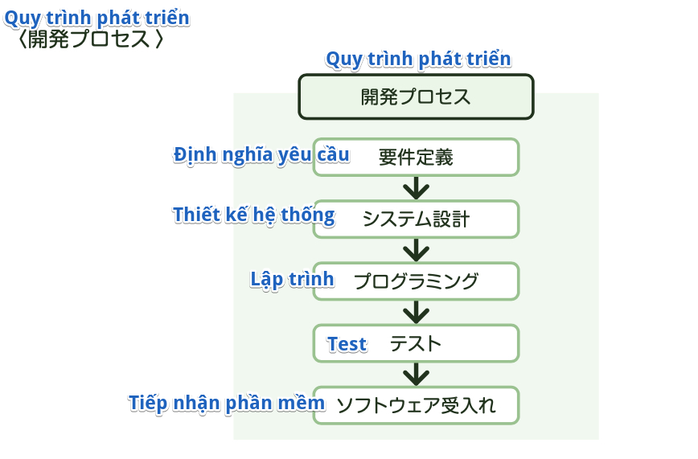

### Quy trình phát triển hệ thống
Hệ thống là cơ cấu kết hợp phần cứng và phần mềm, để chúng xử lý giúp ta những công việc nhất định nào đó. Có nhiều hệ thống
khác nhau xung quanh chúng ta, ví dụ như hệ thống ATM ngân hàng, hay hệ thống đặt chỗ ngồi trên máy bay.
Máy tính được sử dụng cho hệ thống không nhất thiết chỉ có 1 cái. Cũng có những hệ thống quy mô lớn, kết nối cả một mạng lưới nhiều máy tính.

Ta nhận yêu cầu từ bên đặt hàng, lên kế hoạch, thiết kế và phát triển hệ thống tùy theo yêu cầu. Sau khi hoàn thành ổn thỏa, sẽ vừa vận hành vừa bảo trì định kỳ, hết nhiệm vụ thì hủy bỏ.
Có một quy trình xuyên suốt từ khi lên kế hoạch đến khi hủy bỏ trong hệ thống như vậy, nó được gọi là **System Life Cycle**

Trong chương này, ta sẽ đi tìm hiểu chi tiết xem, việc phát triển hệ thống được thực hiện như thế nào. Các bước được thực hiện trong quá trình phát triển theo như flow dưới đây:

Ở các bước trong quy trình này, ta thực hiện những việc dưới đây:

#### Định nghĩa yêu cầu
Ở công đoạn đầu tiên trong phát triển hệ thống, dựa vào request từ bên đặt hàng là "Chúng tôi muốn có cái hệ thống có thể làm được những việc như thế này, để phục vụ cho mục đích như vầy",
ta sẽ đi phân tích nghiệp vụ hiện tại, sắp xếp điều chỉnh lại yêu cầu hệ thống.

※*Hãy biết cả điều này nữa*

    *Yêu cầu phi chức năng (非機能要件)*
    Trong định nghĩa yêu cầu, ngoài những yêu cầu chức năng định nghĩa các chức năng cần thiết cho hệ thống,
    thì ta cũng định nghĩa cả những yêu cầu phi chức năng nữa.
    Ta sẽ làm rõ những yêu cầu chất lượng, yêu cầu kỹ thuật, yêu cầu vận hành/ thao tác... cần thiết để hiện thực hóa 
    yêu cầu nghiệp vụ. Ví dụ như là tạo tiêu chuẩn phát triển phù hợp theo ngôn ngữ lập trình đang được sử dụng trong 
    phát triển hệ thống.

#### Thiết kế hệ thống
Ta sẽ thiết kế hệ thống dựa theo định nghĩa yêu cầu. Ở bước thiết kế hệ thống, ta sẽ suy nghĩ những phần cứng
và phần mềm cần thiết để đạt được mục đích hay chức năng của hệ thống sẽ là gì, rồi vẽ sơ đồ bố trí hay viết bản kế hoạch
thể hiện việc sẽ kết hợp chúng lại như thế nào.  
Trong thiết kế phần mềm, việc thực hiện đầu tiên sẽ là Định nghĩa yêu cầu phần mềm (External design) - ソフトウェア要件定義 
(外部設計). Ta sẽ đi thiết kế dữ liệu logic, ví dụ như là thiết kế phần bề ngoài của hệ thống như màn hình nhập..., hay lọc ra những mục 
dữ liệu cần thiết cho hệ thống, rồi quyết định cấu trúc hệ thống.   
Tiếp theo sẽ là Software architecture design (Internal design) - ソフトウェア方式設計 (内部設計). Dựa vào yêu cầu phần mềm đã quyết định
ở công đoạn trước đó, ta sẽ thiết kế cơ cấu bên trong, đó là quyết định chu trình xử lý hay các chức năng tích hợp vào.
Cuối cùng là Thiết kế chi tiết phần mềm (Detailed design) - ソフトウェア詳細設計 (詳細設計), ta sẽ đi thiết kế cấu trúc program. 
Để dễ dàng phân chia công việc và thực hiện lập trình, phần đông mọi người
sẽ chia ra và thiết kế program đến mức đơn vị chi tiết hơn nữa gọi là module.

#### Lập trình
Dựa theo tài liệu thiết kế, tiến hành lập trình (coding), hoàn thiện các module.

#### Test
Tiến hành test theo giai đoạn, xem đơn lẻ các module, tổng thể phần mềm kết hợp các module lại có hoạt động theo đúng
tài liệu thiết kế hay không.

#### Chấp nhận phần mềm
Đưa vào sử dụng phần mềm trên môi trường phần cứng giống với khi vận hành thực tế, kiểm tra xem nó có hoạt động đúng hay không.
Việc kiểm tra này sẽ do bên người đặt hàng thực hiện. Tuy nhiên, bên nhà cung cấp bán dịch vụ (phần mềm) cũng hỗ trợ nhiều thứ
để có thể tiếp nhận được suôn sẻ, ví dụ như giải thích về cách sử dụng cho bên đặt hàng...

※*Chỗ này thường ra này!*

    *Thuật ngữ*
    [非機能要件] (Yêu cầu phi chức năng): làm rõ các yêu cầu chất lượng, kỹ thuật, vận hành, thao tác 
    cần thiết để hiện thực hóa yêu cầu nghiệp vụ. Ví dụ như là tạo tiêu chuẩn phát triển...
    [ソフトウェア方式設計 (内部設計] (Software architecture design (Internal design)): thiết kế cơ cấu bên trong, 
    xem sẽ hiện thực hóa yêu cầu phần mềm đã quyết định ở công đoạn trước đó như thế nào
    *Skill*
    → Hãy hiểu được quy trình tổng thể, rằng ở các công đoạn trong các bước phát triển thì ta sẽ quyết định những gì 
    và thực hiện những gì.

※*Thử thách với bài test*

    (Fundamental Information Technology Engineer Examination　Mùa xuân năm Heisei 21)
    Đáp án nào dưới đây là phù hợp khi nói về công việc thực hiện ở công đoạn đầu tiên trong phát triển hệ thống?
    ア: Thiết kế cấu trúc bên trong của các program
    イ: Phân tích nghiệp vụ hiện tại, sắp xếp chỉnh lý yêu cầu hệ thống
    ウ: Chia nhỏ sub system đến đơn vị program, thiết kế chi tiết các program
    エ: Thiết kế user interface
    → Answer: イ
    Giải thích: Khi phát triển hệ thống, việc thực hiện đầu tiên đó là Định nghĩa yêu cầu, đi phân tích nghiệp vụ hiện tại, 
    sắp xếp lại xem mình sẽ phát triển hệ thống như thế nào.

※*Thử thách với bài test*

    (Fundamental Information Technology Engineer Examination　Mùa thu năm Heisei 25)
    Giải thích cho định nghĩa yêu cầu phi chức năng là cái nào dưới đây?
    ア: Làm rõ các chức năng nghiệp vụ sẽ khó hiện thực hóa trên hệ thống, phải làm thủ công trong số các yêu cầu nghiệp vụ
    イ: Làm rõ các yêu cầu chất lượng, yêu cầu kỹ thuật, yêu cầu vận hành... cần thiết để hiện thực hóa yêu cầu nghiệp vụ
    ウ: Làm rõ các chức năng bị thiếu ở hệ thống hiện hành, để xác định được yêu cầu nghiệp vụ
    エ: Làm rõ tính tương thích của package đưa vào sử dụng mới, để hiện thực hóa yêu cầu nghiệp vụ
    → Answer: イ
    Giải thích: Ở yêu cầu phi chức năng, ta sẽ làm rõ những yêu cầu chất lượng, kỹ thuật, vận hành, thao tác... cần thiết 
    để hiện thực hóa yêu cầu nghiệp vụ.

※*Thử thách với bài test*

    (Fundamental Information Technology Engineer Examination　Mùa xuân năm Heisei 25)
    Công việc cần phải làm ở ソフトウェア方式設計 (Software architecture design) trong quy trình phát triển là cái nào dưới đây?
    ア: Hỏi ý kiến khách hàng rồi quyết định spec
    イ: Quyết định sẽ hiện thực hóa yêu cầu phần mềm đã chốt trước đó như thế nào
    ウ: Chi tiết hóa để rõ ràng đến xử lý theo từng dòng program
    エ: Tổng hợp nội dung yêu cầu thành biểu đồ, bảng biểu,..., từng bước chi tiết hóa rồi phân tích 
    → Answer: イ
    Giải thích: Ở ソフトウェア方式設計 (Software architecture design), ta sẽ quyết định kết hợp và hiện thực hóa phần mềm như thế nào

***Note:**   
1/ ソフトウェア方式設計 là khái niệm chỉ có của Nhật. Mình đã thử search từ khóa tiếng Anh với ý nghĩa tương đồng, nhưng không có.  
Có vẻ như họ định nghĩa 方式設計 là một phần trong khâu 基本設計 (Basic design)   
基本設計 (Basic design) trong Hệ thống thông tin xuất phát từ 機能設計 (Functional design) - thứ định nghĩa "方式設計" 
quyết định cấu trúc (architect) phần cứng/ phần mềm và phương châm implement VÀ 外部仕様 (External specification) của hệ thống 
khi nhìn từ quan điểm của user (chức năng, màn hình, form nhập, dữ liệu).  
Ngoài ra, cũng thực hiện thiết kế hiệu năng, độ tin cậy, hay thiết kế bảo mật, thiết kế migration, thiết kế operation...　　 
   
Reference: [https://blogs.itmedia.co.jp/omowaku/2007/10/post_129a.html](https://blogs.itmedia.co.jp/omowaku/2007/10/post_129a.html)

2/ Có một cách chia khác về giai đoạn thiết kế trong quá trình phát triển hệ thống, sau khi định nghĩa yêu cầu (要件定義).  
Đó là: 基本設計・外部設計 (Basic design/ External design) → 詳細設計・内部設計 (Detailed design/ Internal design)   
Trong Basic design/ External design lại chia ra làm 3 loại nhỏ hơn nữa là 方式設計, 機能設計 và その他の設計   
- 方式設計 (アーキテクチャ設計):  
Quyết định cấu trúc phần cứng/ phần mềm, phương châm implement  
→ Thiết kế Platform (Quyết định Infra, Middleware, Platform, Framework...)  
→ Thiết kế Application, Architecture (Quyết định cấu trúc tổng thể của application)   
→ Quyết định tiêu chuẩn phát triển hay cách thức test
  
- 機能設計 (アプリケーション設計)  
Chia tổng thể hệ thống ra thành đơn vị module, quyết định external spec cho các module   
→ Thiết kế Business logic  
→ Thiết kế Database  
→ Thiết kế màn hình, form nhập  
→ Thiết kế batch
  
- その他の設計  
→ Thiết kế hiệu năng, tính tin cậy  
→ Thiết kế migration (hệ thống/ nghiệp vụ)  
→ Thiết kế operation (hệ thống/ nghiệp vụ)
  
Trong Detailed design/ Internal design thì có
+ Phân chia chức năng
+ Thiết kế physical data
+ Thiết kế chi tiết input, output

Reference:  
[https://qiita.com/mikakane/items/b8045a11dba8d08e5fe4](https://qiita.com/mikakane/items/b8045a11dba8d08e5fe4)  
[https://tiengnhatmuonmau.com/post/622](https://tiengnhatmuonmau.com/post/622)

3/ Basic Design, Detailed design cũng là Wasei-eigo!!! [Xem bài viết trước đây về 和製英語](https://sakazutoshi.com/posts/wasei-eigo/)  
Ở trên, ta có bắt gặp khái niệm 方式設計, tương tự với khái niệm này thì
trong tiếng Nhật cũng có các từ như アーキテクチ設計, 概要設計, dịch ra tiếng Anh là Architecture design. 
Ở Mỹ thì từ tương ứng sẽ là High-level design  

基本設計 dịch thẳng ra là Basic design, nhưng đây cũng là một từ Wasei-eigo. Các nước nói tiếng Anh không sử dụng từ như vậy.
Từ sát nghĩa nhất sẽ là Functional Design (mô tả program cần làm những gì)      

詳細設計 thì có lẽ cụm từ thích hợp nhất tương ứng trong tiếng Anh sẽ là Technical design (mô tả chức năng sẽ được implement như thế nào ở level code)  

Reference: [http://americanprojectmanagement.blogspot.com/2017/06/basic-design.html](http://americanprojectmanagement.blogspot.com/2017/06/basic-design.html)

