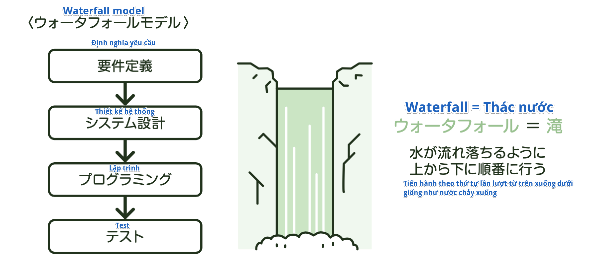
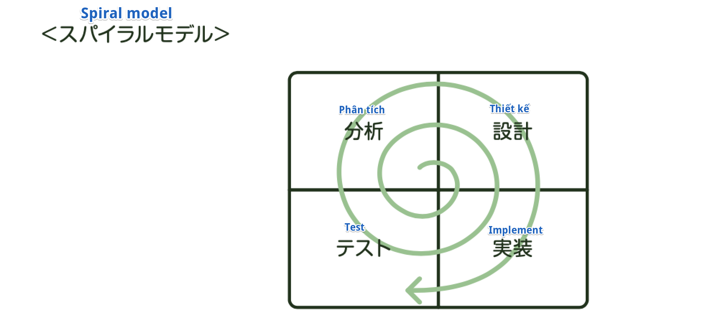

### Các phương pháp phát triển hệ thống
Có một số loại trong cách tiến hành phát triển, ở những loại chính ta có **Waterfall model**, **Prototyping model**, **Spiral model**.

#### Waterfall model
Phương pháp phát triển tiến hành theo trình tự "Định nghĩa yêu cầu" → "Thiết kế hệ thống" → "Lập trình" → "Test" được gọi là **Waterfall model**. Thứ đã giải thích ở "5-1 Khái quát phát triển hệ thống" chính là phương pháp phát triển này. Do tiến hành theo trình tự từ đầu, nên nó có đặc trưng là dễ nắm được tình hình tiến triển. Ngược lại, một khi đã tiến qua process tiếp theo, sẽ khó quay trở về process trước đó để chỉnh sửa, nên khi mỗi một công đoạn kết thúc, cần phải check thật kỹ để không phải quay trở lại công đoạn trước đó.

※*Hãy biết cả điều này nữa*

    *Chi phí (cost) cần để sửa chữa*
    Trong phát triển theo mô hình Waterfall model, nếu test vận hành 
    mà phát hiện ra sai sót, thì chi phí cần để sửa chữa sẽ rất cao, 
    đến mức nguyên nhân là do công đoạn thượng nguồn trong quá trình phát triển

#### Prototyping model
Phương pháp tạo sản phẩm thử nghiệm (Prototype) từ đầu, rồi nhờ người sử dụng (người đặt hàng) kiểm tra hiệu quả hay tính hữu dụng và tiến hành phát triển song song được gọi là Prototyping model. Dẫu có hiểu sai, hiểu nhầm giữa người đặt hàng và người phát triển, thì vẫn có thể xác nhận và chỉnh sửa từ sớm, nên có thể giảm thiểu sai sót hay quay trở lại phát triển.

#### Spiral model
Khi qua đến hệ thống có quy mô lớn, thì tiến hành làm tất cả hệ thống theo quy trình Waterfall model sẽ rất vất vả, và tạo Prototype cũng không đơn giản. Trong những trường hợp như vậy, người ta sẽ chia hệ thống ra thành một vài hệ thống con (subsystem), tiến hành phát triển theo Spiral model lặp lại các vòng tròn (cycle) phát triển. Các hệ thống con đã hoàn thiện thì sẽ tạo Prototype để nhờ người dùng đánh giá, rồi lấy đó làm bộ phận để phát triển hệ thống con lớn hơn nữa. Quá trình làm như vậy để rồi các hệ thống con dần dần lớn lên làm ta hình dung tới xoắn ốc (spiral), nên nó được gọi là Spiral model.

※*Hãy biết cả điều này nữa*

    *Phát triển Agile*
    Agile có nghĩa là "Mang tính nhanh nhạy". Đây là phương pháp phát triển 
    theo kiểu phái sinh từ Spiral model, vừa lặp lại vòng tròn (cycle) phát triển 
    trong thời gian ngắn theo đơn vị tuần, vừa hoàn thiện các chức năng theo giai đoạn. 
    Nó có ưu điểm là rút ngắn thời gian phát triển, có thể xử lý đối phó linh hoạt 
    đối với những thay đổi về spec.

※*Chỗ này thường ra này!*

    *Thuật ngữ*
    [ウォータフォールモデル] (Waterfall model): phát triển theo thứ tự 
    Định nghĩa yêu cầu → Thiết kế hệ thống → Lập trình → Test
    [プロトタイピング] (Prototyping): vừa tạo sản phẩm thử nghiệm vừa phát triển
    [スパイラルモデル] (Spiral model): lặp lại các development cycle để phát triển

※*Thử thách với bài test*

    (Fundamental Information Technology Engineer Examination Mùa xuân năm Heisei 21)
    Giải thích cho Waterfall model trong phát triển hệ thống là cái nào dưới đây
    ア: Không đi tạo tất cả trong 1 lần phát triển, mà phát triển theo từng giai đoạn 
    ứng với độ ưu tiên của chức năng, trên cơ sở kiến trúc hệ thống cơ bản
    イ: Chia công đoạn phát triển ra thành Thiết kế, Implement, Test,..., 
    khi hoàn thành công đoạn trước thì dùng thành quả đó để thực hiện công đoạn tiếp theo
    ウ: Tạo sản phẩm thử nghiệm, feeback (phản hồi) yêu cầu của người dùng để tiến hành phát triển 
    エ: Không cố tạo toàn bộ phần mềm phức tạp từ đầu, mà tiến hành lặp lại các bước 
    Phân tích, Thiết kế, Implement, Test từ những phần đơn giản, rồi từ từ mở rộng ra
    → Answer: イ
    Giải thích: Waterfall model là phương pháp phát triển chia các công đoạn phát triển ra thành 
    Thiết kế, Implement, Test,..., và tiến hành làm theo thứ tự này.

※*Thử thách với bài test*

    (Fundamental Information Technology Engineer Examination Mùa thu năm Heisei 23)
    Phương pháp phát triển phần mềm vừa lặp lại quy trình phát triển 
    từ phân tích yêu cầu đến implement, vừa đi xây dụng nên hệ thống 
    là cái nào dưới đây
    ア: Waterfall model
    イ: Spiral model
    ウ: Prototyping model
    エ: Relational model
    → Answer: イ
    Giải thích: Phương pháp phát triển xây dựng nên hệ thống bằng cách 
    lặp lại vòng tròn phát triển là Spiral model