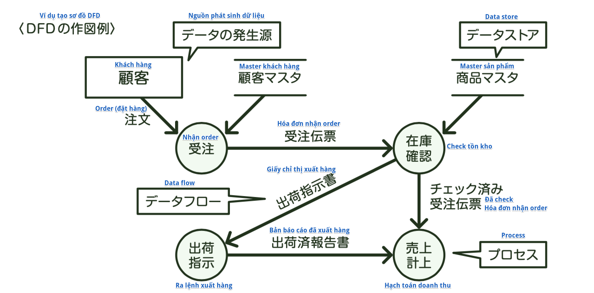
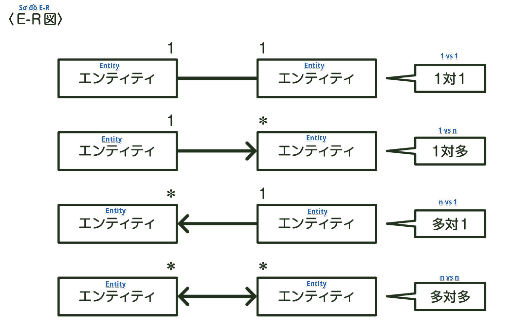
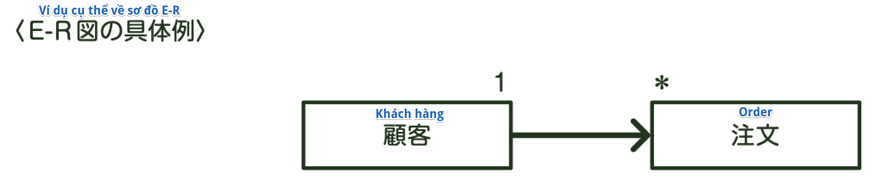
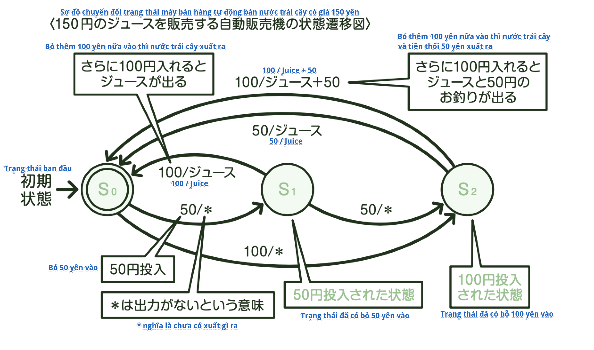

### Phương pháp mô hình hóa
Vào lúc bắt đầu phát triển hệ thống, trước tiên, ta sẽ dùng sơ đồ để giải thích một cách dễ hiểu quy trình nghiệp vụ (business process), hay quan hệ giữa các thông tin sẽ sử dụng (data class) mà ta định tạo thành hệ thống. Công việc này được gọi là *Mô hình hóa nghiệp vụ*. Hãy cùng xem những cách dùng sơ đồ lý giải được sử dụng khi mô hình hóa nhé.

### DFD (Sơ đồ luồng dữ liệu)
DFD (Data Flow Diagram) là phương pháp lý giải bằng sơ đồ chú trọng đến luồng dữ liệu, từ đó phân tích nghiệp vụ đối tượng. Nó có ưu điểm là dễ dàng check được nội dung nghiệp vụ bằng cách biến luồng dữ liệu (data flow) và quy trình xử lý dữ liệu thành sơ đồ. Tuy nhiên, DFD không thể diễn tả về thời gian, ví dụ như thời điểm xử lý.
Ký hiệu được sử dụng trong DFD có 4 loại dưới đây.

<Các ký hiệu sử dụng trong DFD>

| Ký hiệu     | Tên gọi     | Ý nghĩa     |
| ----------- | ----------- | ----------- |
|  | Data store | Lưu trữ dữ liệu như file, business form hay database... |
|  | Data flow | Luồng dữ liệu. Phía trên luồng dữ liệu sẽ ghi mô tả tên dữ liệu  |
|  | Process | Xử lý hay biến đổi dữ liệu |
|  | Nguồn phát sinh dữ liệu (nguồn); Điểm đến của dữ liệu (hấp thụ)| Nguồn phát sinh, hoặc là điểm đến cuối cùng của dữ liệu |

### Sơ đồ E-R
Sơ đồ E-R (Entity-Relationship Diagram) là thứ thể hiện cấu trúc dữ liệu bởi 2 khái niệm Thực thể (Entity) và Mối quan hệ (Relationship) giữa các thực thể với nhau, được dùng trong việc phân tích sự liên quan giữa các dữ liệu.
Trên sơ đồ E-R, ta vẽ "Thực thể" bằng hình chữ nhật, thể hiện "Mối liên quan giữa các thực thể" bằng đường thẳng hoặc dấu mũi tên. Tùy theo sự khác biệt về quan hệ, mà chia ra làm 4 loại dưới đây.

Ví dụ, ta sẽ thử đi vẽ sơ đồ E-R cho quy trình nghiệp vụ đơn giản nhất là "Khách hàng thực hiện order". Nếu thử suy nghĩ theo hướng "Order" từ "Khách hàng", thì do 1 khách hàng sẽ đặt nhiều order, nên sẽ là quan hệ 1 nhiều (1-n)
Ngược lại, nếu suy nghĩ theo hướng "Khách hàng" từ "Order", thì vì 1 order được đặt từ 1 khách hàng, nên sẽ là quan hệ 1 1.
Do đó, sẽ ra mô tả sơ đồ E-R như dưới đây:

### Sơ đồ chuyển đổi trạng thái
Sơ đồ chuyển đổi trạng thái là sơ đồ được sử dụng khi mô tả hoạt động sẽ thực thi đi theo cùng động lực gây biến đổi trạng thái như trải qua một khoảng thời gian hay có tín hiệu kiểm soát,... và sự biến đổi. Nó rất tiện trong việc phân tích hay thiết kế hệ thống mang tính real time - điều mà DFD không làm được tốt. Trong phát triển hệ thống, nó được sử dụng để thể hiện những thay đổi về nghiệp vụ hay di chuyển màn hình...

※*Chỗ này thường ra này!*

    *Thuật ngữ*
    [DFD]: Chú trọng đến luồng dữ liệu để thể hiện
    [E-R図] (Sơ đồ E-R, ERD): Chú trọng đến Thực thể (Entity)
    và Quan hệ (Relationship) giữa các thực thể để thể hiện cấu trúc dữ liệu 
    [状態遷移図] (Sơ đồ chuyển đổi trạng thái): Thể hiện sự chuyển đổi trạng thái 
    của hệ thống. Được áp dụng cho hệ thống real time

※*Thử thách với bài test*

    (Fundamental Information Technology Engineer Examination Mùa xuân năm Heisei 27)
    Giải thích cho Sơ đồ E-R là cái nào dưới đây?
    ア: Là sơ đồ thể hiện model hướng đối tượng
    イ: Là sơ đồ thể hiện tình hình trạng thái biến đổi theo thời gian hay hành động,...
    ウ: Là sơ đồ thể hiện thế giới đối tượng bởi 2 khái niệm là Thực thể và Quan hệ
    エ: Là sơ đồ thể hiện một cách dễ hiểu, trực quan luồng dữ liệu
    → Answer: ウ
    Giải thích: Sơ đồ E-R là sơ đồ chú trọng đến thực thể và mối quan hệ giữa các thực thể để thể hiện thông tin.

※*Thử thách với bài test*

    (Fundamental Information Technology Engineer Examination Mùa xuân năm Heisei 25)
    Khi thiết kế, hệ thống nào dưới đây là thích hợp nhất để sử dụng sơ đồ chuyển đổi trạng thái?
    ア: Hệ thống kiểm kê tồn kho xử lý tính tổng tài sản kiểm kê vào cuối tháng và khi quyết toán
    イ: Hệ thống báo cáo tình hình hoạt động tài nguyên hệ thống, lấy tình hình hoạt động hàng ngày 
    của tài nguyên hệ thống để xuất ra làm report
    ウ: Hệ thống tính toán tiền nước bằng cách nhập dữ liệu đồng hồ đo nước sinh hoạt để tính toán tiền phí
    エ: Hệ thống kiểm soát nhiệt độ, giữ môi trường trong nhà kính ở mức hợp lý nhất 
    từ thông tin cảm biến được lắp đặt
    → Answer: エ
    Giải thích: Sơ đồ chuyển đổi trạng thái thích hợp để thiết kế hệ thống real time 
    giống như hệ thống kiểm soát nhiệt độ
