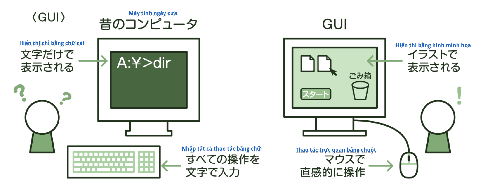
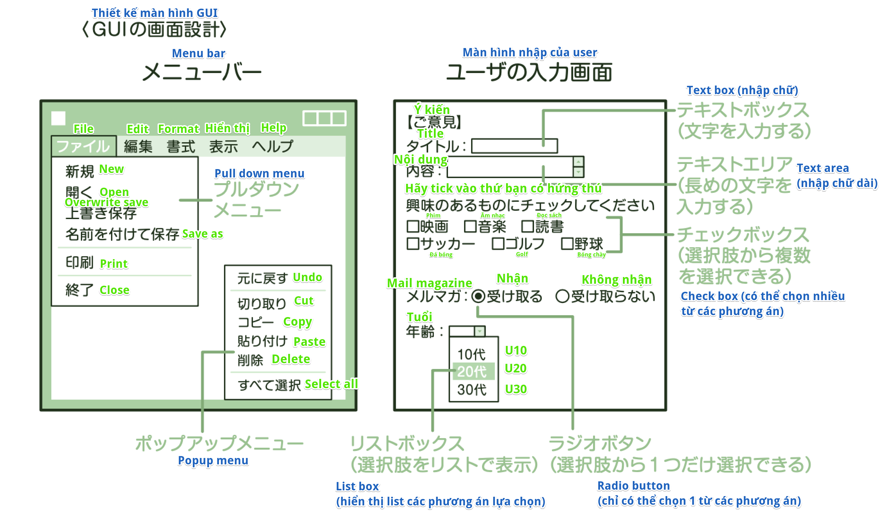

### Thiết kế human interface
Ở định nghĩa yêu cầu phần mềm thiết kế phần bề ngoài của hệ thống (External design), ta sẽ thiết kế các cách hiển thị thông tin đối với user hay những màn hình mà user sẽ thao tác thực tế. Phần gắn kết user với máy tính kiểu như vậy được gọi là *Human interface*. Human interface cần phải suy nghĩ xem "Có dễ dàng sử dụng đối với user hay không" để còn thiết kế. "Tính dễ dàng sử dụng" được gọi là *Usability*.

※*Chỗ này thường ra này!*

    *Thuật ngữ*
    [ヒューマンインタフェース] (Human interface): Suy nghĩ đến usability (tính khả dụng) để thiết kế 

### GUI
GUI (Graphical User Interface) hiện tại đang rất phổ biến cũng là thứ có suy xét đến usability. GUI tức là user interface (giao diện người dùng) sử dụng hình minh hoạ để hiển thị thông tin cho user. Do những máy tính trước đây hiển thị bằng chữ cái, thao tác cũng thực hiện bằng cách nhập chữ, nên những ai không có kiến thức chuyên môn sẽ không thao tác được. Tuy nhiên, do GUI hiển thị bằng hình minh họa thay vì bằng chữ cái, có thể dùng chuột để thao tác, nên có thể thao tác một cách trực quan.

### Thiết kế màn hình GUI

Ở thiết kế màn hình GUI, ta có thể cho hiển thị nội dung thao tác của hệ thống phát triển theo kiểu menu. Ta quan tâm đến usability, cố gắng hết sức để hình dạng hay vị trí của các button hay menu chung ở màn hình nào cũng giống nhau.
Thêm nữa, ở màn hình user nhập dữ liệu, bằng cách cố gắng bỏ công chuẩn bị trước các phương án lựa chọn, thì sẽ có thể giảm bớt công sức, thời gian nhập vào cho user. Cụ thể, ta có thể thiết kế bộ phận kiểu như dưới đây

※*Hãy biết cả điều này nữa*

    *Chức năng macro*
    Chức năng gom một loạt các câu lệnh lại làm một, chạy bằng 1 câu lệnh được gọi là *Chức năng macro*.
    Nó được sử dụng với mục đích giảm bớt số lượng thao tác của user thực hiện những tác vụ cố định thường xuyên

※*Chỗ này thường ra này!*

    *Thuật ngữ*
    [プルダウンメニュー] (Pull down menu): Khi click vào button thì các mục chọn hiển thị ra làm một list
    [チェックボックス] (Check box): Có thể chọn nhiều từ trong số các phương án
    [ラジオボタン] (Radio button): Chỉ có thể chọn 1 từ trong số các phương án
    [リストボックス] (List box): Các phương án lựa chọn hiển thị ra theo menu
    [マクロ機能] (Chức năng macro): Gộp một chuỗi các câu lệnh lại làm một rồi chạy

※*Thử thách với bài test*

    (Fundamental Information Technology Engineer Examination Mùa thu năm Heisei 25)
    Ở một cửa hàng nọ, đang quản lý khoảng 200 mặt hàng. Trong số các mục nhập ở màn hình Đăng ký mới dữ liệu sản phẩm, thứ nào dưới đây là thích hợp để sử dụng Pull down menu làm phương thức nhập?
    |    |    Mục             |                  Hình thức và quy tắc                                    |
    | -- | ------------------ | ------------------------------------------------------------------------ |
    | ア | Mã số sản phẩm     | Là mục chữ và số tiếng Anh có 5 ký tự, đánh số theo từng sản phẩm         |
    | イ | Tên sản phẩm       | Là mục tiếng Nhật trong vòng 40 ký tự trở lại, đặt tên theo từng sản phẩm |
    | ウ | Phân loại sản phẩm | Là mục tiếng Nhật trong vòng 10 ký tự trở lại, có 5 phân loại             |
    | エ | Giá                | Là mục số có 6 chữ số, phạm vi từ 10,000 ~ 100,000 yên                    |
    → Answer: ウ
    Giải thích: Pull down menu là khi click vào button, các mục lựa chọn sẽ hiển thị ra làm một list. 
    Do đó, nó sẽ thích hợp với phương thức nhập Phân loại sản phẩm có số mục chọn giới hạn 

※*Thử thách với bài test*

    (Fundamental Information Technology Engineer Examination Mùa xuân năm Heisei 26)
    Trong số các chức năng Human interface, thứ được sử dụng với mục đích giảm bớt số thao tác của người dùng 
    thực hiện các tác vụ cố định một cách thường xuyên là cái nào dưới đây?
    ア: Chức năng macro gom một chuỗi các câu lệnh lại làm một
    イ: Chức năng gom lại và hiển thị input error ở màn hình cuối cùng
    ウ: Chức năng hiển thị hiện tại đang tiến hành đến đâu trong số tất cả công đoạn
    エ: Chức năng có thể trả về trạng thái trước đó khi thao tác bị nhầm
    → Answer: ア
    Giải thích: Khi sử dụng chức năng macro gom một chuỗi các tác vụ lại rồi chạy luôn một lần, 
    có thể giảm số thao tác của người dùng