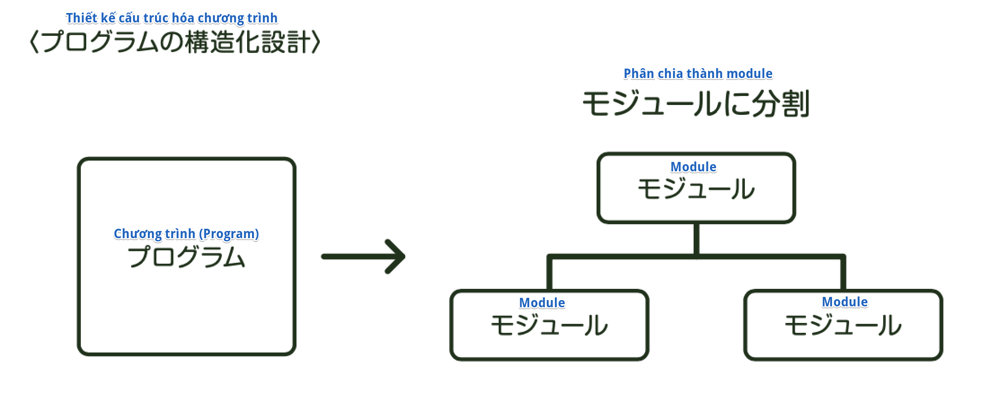
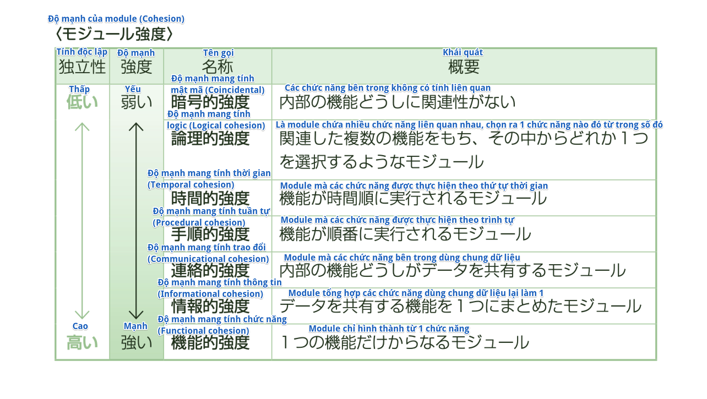
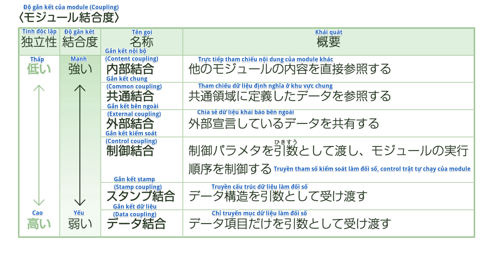

### Thiết kế cấu trúc hóa chương trình
Trong thiết kế chi tiết phần mềm, ta chia program ra thành đơn vị chứa một cụm chức năng được gọi là *Module*. Ta gọi việc này là thiết kế cấu trúc hóa chương trình. Bằng cách chia chương trình ra thành nhiều module, sẽ có thể phát triển chương trình với nhiều người đảm nhiệm. Hơn nữa, do có thể test theo đơn vị module, nên dù có xảy ra vấn đề thì cũng dễ dàng xác định được nguyên nhân, chỉ cần fix trong module là được.

### Tính độc lập của module
Để nâng cao tính tin cậy và tính bảo trì của chương trình, người ta cố gắng giảm bớt chức năng bỏ trong 1 module hết sức có thể, nâng cao tính độc lập của các module. Bởi vì tính độc lập càng cao, thì dù có module nào đó bị trục trặc hay thay đổi, thì ảnh hưởng đến các module khác càng ít đi. Tính độc lập của module đánh giá bằng *độ mạnh của module* và *độ gắn kết của module*.

#### Độ mạnh của module
Thứ thể hiện độ mạnh về quan hệ giữa các chức năng trong 1 module gọi là *Độ mạnh của module*. Tùy theo cách liên hệ giữa module với nhau mà phân ra làm 7 loại dưới đây. Độ mạnh của module càng lớn thì tính độc lập của module càng cao.

#### Độ gắn kết của module
Thứ thể hiện độ mạnh của quan hệ giữa các module được gọi là *Độ gắn kết của module*. Tùy theo cách liên hệ giữa module với nhau mà phân ra làm 6 loại dưới đây. Độ gắn kết của module càng yếu thì tính độc lập của module càng cao.

※*Hãy biết về bài thi*

    Vì trong bài thi sẽ có hỏi nhiều về cái mạnh nhất hay yếu nhất
    trong Độ mạnh của module hay Độ gắn kết của module, nên ta hãy 
    nắm thật rõ về thứ mạnh nhất, yếu nhất, và đặc biệt rõ đến mức nội dung. 
    Và hãy chú ý đọc kỹ đề bài, xem thứ được hỏi là về độ mạnh hay độ gắn kết, 
    đừng để bị nhầm 

※*Chỗ này thường ra này!*

    *Thuật ngữ*
    [モジュール強度] (Độ mạnh của module - Module Cohesion): Mạnh nhất là độ mạnh mang tính chức năng (Functional cohesion), 
    yếu nhất là độ mạnh mang tính mật mã (Coincidental). Càng mạnh thì tính độc lập của module càng cao.
    [モジュール結合度] (Độ gắn kết của module - Module Coupling): Mạnh nhất là gắn kết nội bộ (Content coupling), yếu nhất 
    là gắn kết dữ liệu (Data coupling). Càng yếu thì tính độc lập của module càng cao.

※*Thử thách với bài test*

    (Fundamental Information Technology Engineer Examination Mùa xuân năm Heisei 20)
    Để nâng cao tính độc lập của module, cần phải chỉnh cho độ gắn kết của module yếu đi. Trong số 
    các cách truyền thông tin giữa các module, cái nào dưới đây có độ gắn kết module là yếu nhất?
    ア: Module liên quan tham chiếu dữ liệu định nghĩa ở khu vực chung
    イ: Truyền tham số kiểm soát làm đối số, control trật tự chạy của module
    ウ: Chỉ truyền mục dữ liệu làm đối số giữa các module
    エ: Khai báo bên ngoài và chia sẻ những dữ liệu cần thiết
    → Answer: ウ
    Giải thích: Nếu sắp xếp theo thứ tự độ gắn kết từ mạnh đến yếu, thì sẽ là ア) Gắn kết chung (Common coupling), 
    エ) Gắn kết bên ngoài (External coupling), イ) Gắn kết kiểm soát (Control coupling), ウ) Gắn kết dữ liệu (Data coupling), 
    và ウ) Gắn kết dữ liệu (Data coupling) là cái có độ gắn kết module yếu nhất.

***Note:**   
Đây là một bài viết nặng về lý thuyết và yêu cầu cần có hiểu biết cũng như kinh nghiệm về kỹ thuật. Do dịch từ tiếng Nhật nên cách dùng từ có thể chưa được hợp lý. Mình đã tìm hiểu và chú thích thêm khái niệm trong tiếng Anh để dễ hiểu hơn. Tuy nhiên, còn nhiều chỗ giải thích chưa được đầy đủ, rõ ràng và chưa có phần ví dụ. Để tìm hiểu thêm, bạn có thể tham khảo các tài liệu dưới đây, cũng như tra cứu bằng các từ khóa có trong bài.

Reference: 
1) https://viblo.asia/p/tim-hieu-ve-coupling-va-cohesion-bJzKmo7El9N
2) https://edwardthienhoang.wordpress.com/2018/01/08/low-coupling-and-high-cohesion/
3) https://online.grokking.org/links/401/coupling-la-gi-
4) http://www.kogures.com/hitoshi/webtext/kj2-module/