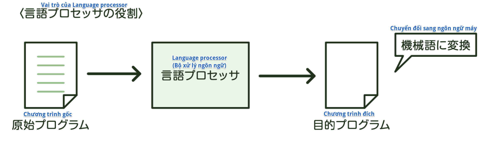
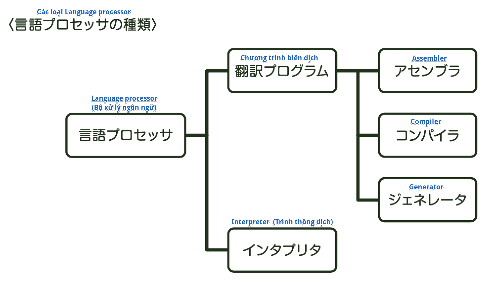
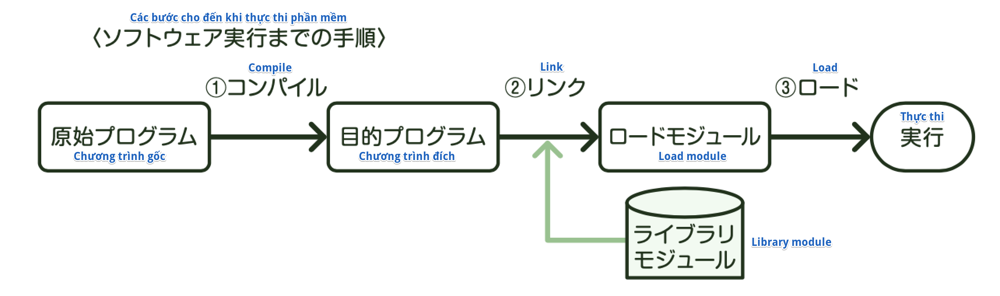
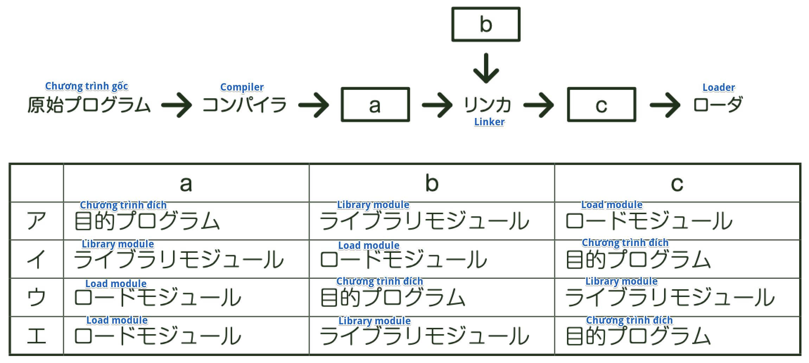

### Lập trình là gì?
Người ta dùng ngôn ngữ chuyên dụng để tạo nên chương trình theo đơn vị module đã chia ở bước thiết kế chi tiết phần mềm. Công việc tạo lập này được gọi là Lập trình - Programming (Coding)

※*Hãy biết cả điều này nữa*

    *Tiêu chuẩn hóa lập trình*
    Việc quyết định quy tắc nhất định như đặt tên biến hay comment... 
    với mục đích khiến cho nội dung xử lý của chương trình trở nên dễ hiểu 
    được gọi là *Tiêu chuẩn hóa lập trình*. Nó có hiệu quả là giúp chương trình 
    dễ đọc, phòng ngừa trước những lỗi mà lập trình viên dễ phạm phải.

### Ngôn ngữ lập trình
Ngôn ngữ chuyên dụng để viết chương trình được gọi là *Ngôn ngữ lập trình*. Có nhiều loại khác nhau trong ngôn ngữ lập trình. Ngôn ngữ lập trình mà máy tính dễ hiểu hơn được gọi là *Ngôn ngữ bậc thấp*, ngôn ngữ lập trình dễ hiểu đối với con người được gọi là *Ngôn ngữ bậc cao*.
Trong ngôn ngữ bậc thấp có các loại như ngôn ngữ máy, ngôn ngữ Assembly... Ngược lại, trong ngôn ngữ bậc cao có COBOL, FORTRAN, C, BASIC, Pascal, C++, Java...

### Language processor (Bộ xử lý ngôn ngữ)
Máy tính chỉ có thể hiểu được chương trình viết bằng ngôn ngữ máy. Do đó, *Chương trình gốc* (Source program) là chương trình do con người mô tả không thể nào giữ nguyên như thế mà chạy trên máy tính được. Vì vậy, cần sử dụng chương trình dịch gọi là *Language processor* để dịch ra *Chương trình đích* là chương trình ngôn ngữ máy.

Tùy theo cách dịch mà có thể phân loại Language processor ra thành *Assembler*, *Compiler*, *Generator*, *Interpreter*

#### Assembler
*Assembler* là Language processor dịch chương trình gốc được viết bằng ngôn ngữ Assembly sang chương trình đích. Ngôn ngữ Assembly phân chia ký hiệu ra thành ngôn ngữ máy, lệnh được dịch sang ngôn ngữ máy theo nguyên tắc 1-1. Việc dịch bằng Assembler được gọi là *Assemble*.

#### Compiler
*Compiler* là Language processor tổng hợp lại một lần chương trình gốc  được viết bằng ngôn ngữ bậc cao rồi mới dịch sang chương trình đích. Việc dịch bằng compiler được gọi là *Compile*

#### Generator
*Generator* là Language processor tự động generate ra chương trình ứng với mục đích xử lý, bằng cách chỉ thị những điều kiện cần thiết như nhập vào, xử lý, xuất ra,... bằng parameter là giá trị setting.

#### Interpreter
*Interpreter* là Language processor diễn giải rồi chạy từng dòng một chương trình được viết bằng ngôn ngữ bậc cao. Do không tạo ra chương trình đích với ngôn ngữ máy, nên cần phải diễn giải cứ mỗi khi chạy, khiến tốc độ chạy chương trình chậm đi. Dù có lỗi cú pháp ở giữa chừng chương trình thì interpreter vẫn có thể chạy đến ngay trước lỗi đó.

※*Chỗ này thường ra này!*

    *Thuật ngữ*
    [アセンブラ] (Assembler): Dịch chương trình gốc được viết bằng ngôn ngữ Assembly sang ngôn ngữ máy
    [コンパイラ] (Compiler): Tổng hợp lại chương trình gốc rồi dịch một lần sang ngôn ngữ máy
    [ジェネレータ] (Generator): Chỉ thị từ parameter, tự động generate ra chương trình ứng với mục đích của xử lý
    [インタプリタ] (Interpreter): Diễn giải rồi chạy từng lệnh 1 của chương trình gốc

※*Hãy biết cả điều này nữa*

    *Translator và Emulator*
    *Translator* là chương trình chuyển đổi chương trình gốc được viết cho xử lý nào đó 
    thành chương trình gốc cho xử lý khác. *Emulator* là vi chương trình (micro program) 
    giải mã, thực thi chương trình dùng cho máy tính khác.

### Các bước cho đến khi chạy phần mềm
Ta sẽ đi xem các bước đến khi một chương trình được viết bằng ngôn ngữ bậc cao theo phương thức Compiler trở thành phần mềm và được thực thi.

#### ① Compile
Trước tiên, nhờ vào *Compiler*, dịch chương trình gốc được viết bằng ngôn ngữ bậc cao sang chương trình đích với ngôn ngữ máy. Lúc này, sẽ đi phân tích chương trình gốc, *việc tối ưu hóa* sẽ được thực hiện để nâng cao hiệu quả xử lý khi thực thi.

#### ② Link
Khi tạo chương trình, không thể chạy với đơn lẻ một chương trình đích mà chỉ mới thực hiện compile. Cần phải gọi chương trình trong library module từ chương trình đích, gọi ra xử lý được viết ở chương trình gốc khác. Library module tức là tập hợp các chương trình đã bộ phận hóa để có thể sử dụng chương trình chứa chức năng xác định nào đó từ chương trình khác. 
Tại đó, bổ sung thêm các library module cần thiết vào chương trình đích đã được dịch bằng compiler, rồi generate ra *Load module* là chương trình có thể thực thi. Công việc này được gọi là *Link* (Liên kết), chương trình thực hiện link được gọi là *Linker*.
Trong link thì có *Link tĩnh* và *Link động*. Link tĩnh là phương pháp link chương trình đích hay library module cần thiết bằng Linker trước khi chạy chương trình. Link động là cách link mà khi cần chức năng thuộc program module khác trong khi chạy chương trình, thì sẽ link chương trình đó bất cứ lúc nào cần. Library file tổng hợp nhóm module phần mềm với tiền đề link động được gọi là *DLL (Dynamic Link Library - thư viện liên kết động)*.

#### ③ Load
Công việc tải vào bộ nhớ chính để chạy load module được gọi là *Load*, do chương trình gọi là *Loader* đảm nhiệm.

※*Chỗ này thường ra này!*

    *Thuật ngữ*
    [最適化] (Tối ưu hóa): Khi compile, phân tích chương trình gốc, 
    tạo chương trình đích nâng cao hiệu suất xử lý khi thực thi
    [リンク] (Link): Kết hợp chương trình đích hay library module 
    rồi generate ra Load module
    [ロード] (Load): Bố trí load module vào bộ nhớ chính

※*Chỗ này thường ra này!*

    *Thuật ngữ*
    [動的リンク] (Link động): Trong khi đang chạy application, tùy theo độ cần thiết 
    mà gọi thư viện liên kết động, kết hợp với bản thể chương trình

※*Hãy biết cả điều này nữa*

    *Refactoring*
    Việc thay đổi cấu trúc bên trong chương trình thay vì thay đổi spec bên ngoài 
    để nâng cao tính bảo trì của phần mềm được gọi là *Refactoring*

### Tính chất của chương trình
Một chương trình hoạt động nhanh, chính xác có thể nói là chương trình tốt, nhưng để tạo ra chương trình tốt như thế, quan trọng là phải hiểu được 4 tính chất của chương trình.

#### Có thể tái sử dụng nối tiếp (Reusable)
Chương trình có thể chạy kể cả sau khi đã tạm thời chạy xong, dù không load lại lần nữa vào bộ nhớ chính được gọi là chương trình có thể tái sử dụng.
Trong đó, chương trình chỉ có thể sử dụng 1 tác vụ cùng một lúc gọi là *Chương trình có thể tái sử dụng liên tiếp*.

#### Có thể tái nhập (Reentrant)
Trong số các chương trình có thể tái sử dụng, chương trình gọi cùng lúc từ 2 tác vụ trở lên mà vẫn hoạt động đúng được gọi là *Chương trình có thể tái nhập*. Do chương trình có thể tái nhập có phần code (thủ tục) và phần dữ liệu được chia ra ở từng vùng bộ nhớ riêng biệt, nên có thể xếp hàng rồi chạy bằng cách chuẩn bị phần dữ liệu theo từng tác vụ.

#### Có thể tái định vị (Relocatable)
Chương trình có thể chạy dù load ở bất cứ vị trí nào trong bộ nhớ chính được gọi là *Chương trình có thể tái định vị*.

#### Mang tính đệ quy (Recursive)
Chương trình có thể tự gọi bản thân nó trong khi đang chạy gọi là *Chương trình mang tính đệ quy*.

※*Hãy biết cả điều này nữa*

    *Reverse engineering*
    Việc phân tích source code của chương trình, rồi dựng lại thông tin thiết kế hay spec của chương trình 
    được gọi là *Reverse engineering*. Ví dụ, từ thông tin định nghĩa hệ thống cơ sở dữ liệu 
    đang hoạt động trên thực tế, sử dụng tool tạo ERD, sinh ra bản thiết kế thể hiện bằng ERD, 
    hay sinh ra sơ đồ class UML từ chương trình tương ứng với công việc này.

※*Chỗ này thường ra này!*

    *Thuật ngữ*
    [逐次再使用可能] (Có thể tái sử dụng nối tiếp): Miễn load 1 lần là có thể chạy bao nhiêu lần. 
    Chỉ có thể sử dụng 1 tác vụ
    [再入可能] (Có thể tái nhập): Có thể sử dụng với nhiều tác vụ cùng một lúc
    [再配置可能] (Có thể tái định vị): Dù load ở bất cứ vị trí nào trên bộ nhớ chính thì vẫn có thể chạy
    [再帰的] (Mang tính đệ quy): Có thể tự gọi bản thân nó
    [リバースエンジニアリング] (Reverse engineering): Phân tích source code, dựng lại cấu trúc hay spec bên trong

※*Thử thách với bài test*

    (Fundamental Information Technology Engineer Examination Mùa xuân năm Heisei 22)
    Khi xử lý của program A nọ chưa kết thúc, dù bị gọi lại từ program khác nhưng vẫn 
    hoạt động đúng, thì lúc này, tính chất của program A này gọi là gì?
    ア: Mang tính đệ quy
    イ: Có thể tái sử dụng
    ウ: Có thể tái nhập
    エ: Có thể tái định vị
    → Answer: ウ
    Giải thích: Dù bị gọi từ 2 chương trình trở lên cùng một lúc nhưng vẫn có thể chạy 
    là Chương trình có thể tái nhập.

※*Thử thách với bài test*

    (Fundamental Information Technology Engineer Examination Mùa xuân năm Heisei 21)
    Sơ đồ bên dưới diễn tả flow dịch rồi thực thi chương trình. 
    Cùng kết hợp với input, output là Compiler, Linker, Loader, thì phương án nào dưới đây là phù hợp nhất?

    
    → Answer: ア
     Giải thích: Khi dịch chương trình gốc bằng Compiler, có thể ra "Chương trình đích". 
    Hơn nữa, "Chương trình đích" ghép thêm "Library module" vào bằng Linker, sẽ ra "Load module" 
    có thể chạy, và được bố trí ở trên bộ nhớ chính bằng Loader.

※*Thử thách với bài test*

    (Fundamental Information Technology Engineer Examination Mùa thu năm Heisei 26)
    Việc sinh ra sơ đồ class UML từ program được gọi là gì?
    ア: Backtracking
    イ: Forward Engineering
    ウ: Re‑engineering
    エ: Reverse engineering
    → Answer: エ
    Giải thích: Sơ đồ class UML là sơ đồ thiết kế chương trình hướng đối tượng. 
    Việc phân tích chương trình, rút ra spec hay cấu trúc bên trọng được gọi là Reverse engineering.